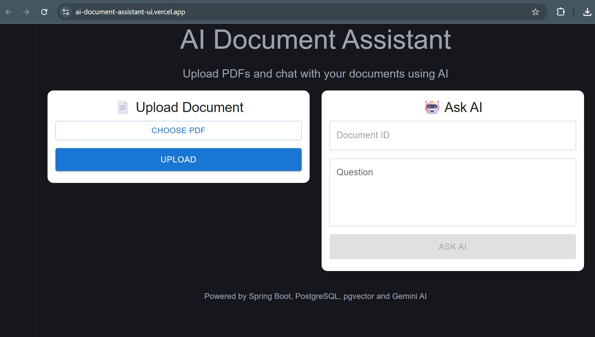
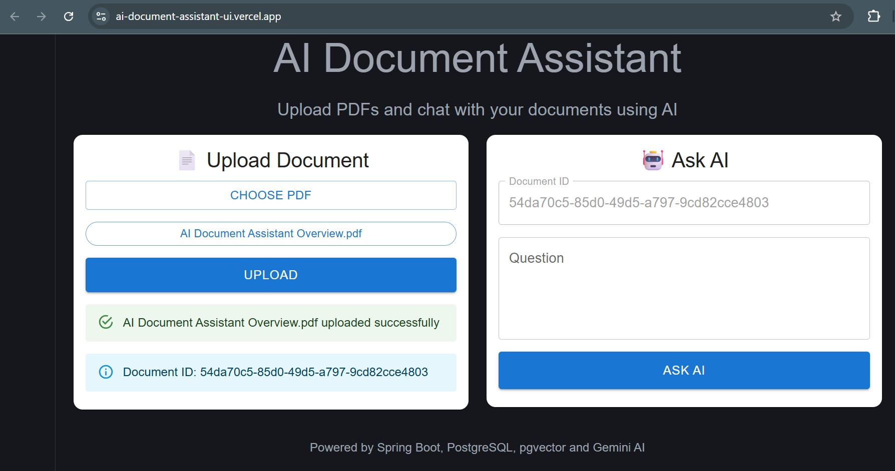
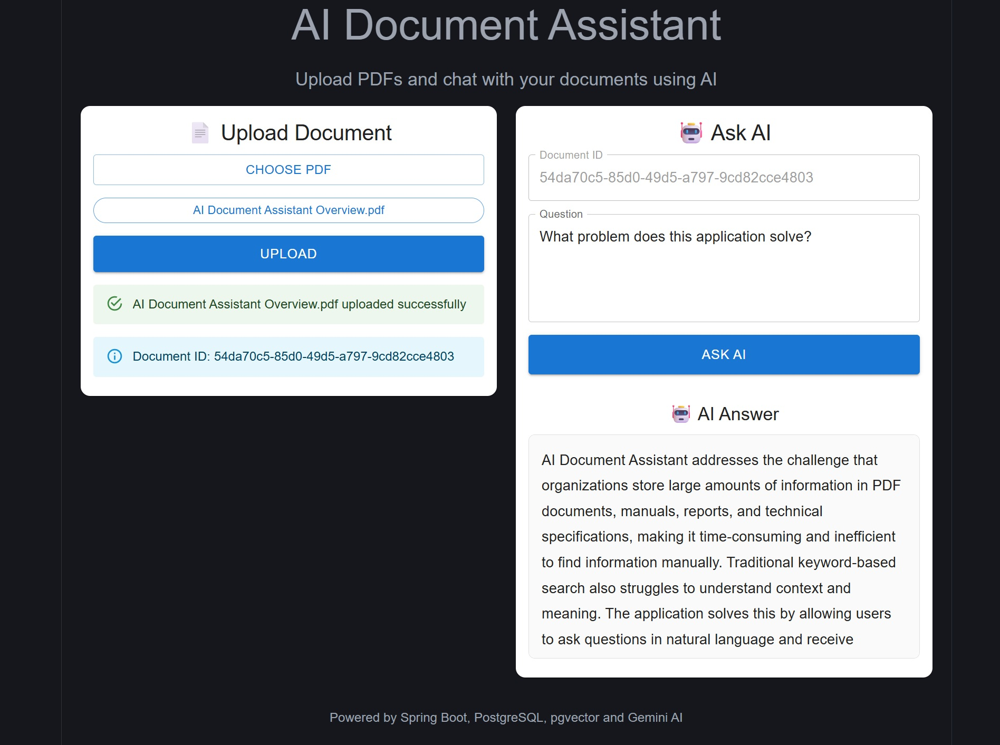

# AI Document Assistant

An AI-powered document question-answering application that allows users to upload PDF documents and ask questions about their content using Retrieval-Augmented Generation (RAG).

Built with Spring Boot, PostgreSQL, pgvector, Gemini AI, React, TypeScript, Material UI, Docker, and Docker Compose.

---

## Features

- Upload PDF documents
- Extract and process document content
- Generate embeddings for document chunks
- Store embeddings in PostgreSQL using pgvector
- Semantic search using vector similarity
- Ask questions about uploaded documents
- Retrieve relevant document context
- Generate AI-powered answers using Gemini
- Responsive React frontend
- Dockerized backend deployment
- Environment variable based configuration

---

## Architecture

```text
+--------------------+
|   React Frontend   |
+---------+----------+
          |
          | REST API
          |
          v
+--------------------+
|   Spring Boot API  |
+---------+----------+
          |
          |
   +------+------+
   |             |
   v             v

Gemini AI    PostgreSQL
               +
            pgvector

```

### RAG Flow

```text
PDF Upload
    |
    v
Text Extraction
    |
    v
Chunking
    |
    v
Embedding Generation
    |
    v
pgvector Storage

User Question
    |
    v
Question Embedding
    |
    v
Vector Similarity Search
    |
    v
Top Matching Chunks
    |
    v
Gemini Prompt
    |
    v
AI Answer
```

---

## Tech Stack

### Backend

- Java 21
- Spring Boot 3
- Spring Web
- Spring Data JPA
- PostgreSQL
- pgvector
- Maven

### AI

- Google Gemini API
- Embeddings
- Retrieval-Augmented Generation (RAG)

### Frontend

- React
- TypeScript
- Vite
- Material UI
- Axios

### DevOps

- Docker
- Docker Compose

---

## Screenshots

### Home Page



### Upload Document



### Ask Questions and get answer



---

## Project Structure

```text
ai-document-assistant
│
├── backend
│   ├── src
│   ├── Dockerfile
│   └── pom.xml
│
├── frontend
│   ├── src
│   ├── public
│   └── package.json
│
└── docker-compose.yml
```

---

## Running Backend Locally

### Clone Repository

```bash
git clone https://github.com/vinod-developer/ai-document-assistant.git

cd ai-document-assistant/backend
```

### Configure Environment Variables

```bash
GEMINI_API_KEY=<your-api-key>
```

### Run Application

```bash
mvn spring-boot:run
```

Backend:

```text
http://localhost:8080
```

Swagger:

```text
http://localhost:8080/swagger-ui.html
```

---

## Running Frontend Locally

```bash
cd frontend

npm install

npm run dev
```

Frontend:

```text
http://localhost:5173
```

---

## Docker

### Build Image

```bash
docker build -t ai-document-assistant .
```

### Run Container

```bash
docker run -p 8080:8080 ai-document-assistant
```

---

## Docker Compose

```bash
docker compose up --build
```

Stop:

```bash
docker compose down
```

---

## API Endpoints

### Upload Document

```http
POST /api/documents/upload
```

### Ask Question

```http
POST /api/documents/question
```

Request:

```json
{
  "documentId": "document-id",
  "question": "What is this document about?"
}
```

Response:

```json
{
  "answer": "Generated AI response"
}
```

## Future Enhancements

- Multi-document support
- Chat history
- User authentication
- Document management dashboard
- Streaming AI responses
- Source citations
- Multi-model support

---

## Key Technologies & Concepts

- Full Stack Development
- REST API Design
- Spring Boot Development
- Vector Databases
- Retrieval-Augmented Generation (RAG)
- LLM Integration
- React + TypeScript
- Docker Containerization
- PostgreSQL + pgvector
- Production Deployment (Railway & Vercel)
- Semantic Search

---

## Live Demo

https://ai-document-assistant-ui.vercel.app/

---
## Demo Videos

### 🎥 English Demo
[demos/english-demo.mp4](demos/english-demo.mp4)

### 🎥 Deutsche Demo 🇩🇪
[demos/german-demo.mp4](demos/german-demo.mp4)

---

## Author

**Vinod Allam**
